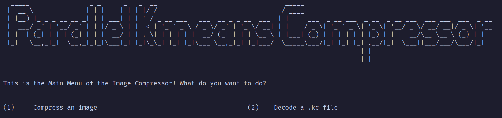
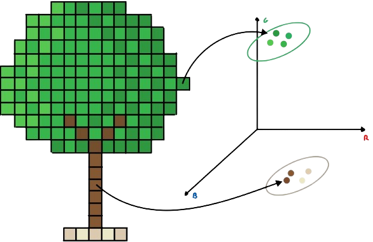

# Parallel Kmeans-based Images Compressor 


This project implements a __parallel KMeans-based image colors compressor__, aimed at reducing the number of colors in a natural image while preserving its overall visual appearance. The program clusters similar colors using the __KMeans algorithm__ and applies __parallel computing techniques__ to compress the image through the __color quantization__ technique. It supports __sequential__, __OpenMP__, __MPI__, and __CUDA__ implementations to explore different levels of performance and scalability.


## Authors 
- __Leonardo Ignazio Pagliochini__  Master's Degree student in High-Performance Computing Engineering  at __Politecnico di Milano__
  
  GitHub: [leonardopagliochini](https://github.com/leonardopagliochini)  
  Email: leonardoignazio.pagliochini@mail.polimi.it

- __Francesco Rosnati__  Master's Degree student in High-Performance Computing Engineering at __Politecnico di Milano__
  
  GitHub: [RosNaviGator](https://github.com/RosNaviGator)  
  Email: francesco.rosnati@mail.polimi.it

This project was developed for the course __Advanced Methods for Scientific Computing__,  
Professor: __Luca Formaggia__  
Assistant Professor: __Matteo Caldana__  
__Politecnico di Milano__


## Doxygen Documentation
The documentation of the project can be found [here](docs/html/index.html).

## Prerequisites 

### TO DO
- testare con VM, alla fine!
- scrivere effettivamente bash commands per installare quant orichiesto (boost/process, opencv, etc ...)
- DISATTIVARE mk modules, va detto
- versione di g++ giusta per nostro MPIC++, quella che vada con `span` e altre cose nuove dello standard 20 o maggiore (mi pare)
- verrsione giusta di g++ per la versione di cuda nostra (ste robe le vedi anche dalle flag del compilatore nel Makefile)
- c++ 20? 23? Checckare non ricordo
- meglio usare `openMPI` rispetto a `mpich`, ha sempre funzionato il primo, il secondo ha dato problemi talvolta
- le librerie che mi vengono in mente sono `boost/process`, `opencv2`, se ce ne sono altre saranno negli `#include`
- puiler dalla mierda lo repo!

<!--
In order to be able to compile and run the program, there are a few programs that need to be installed.

### OpenCV C++ Library
A comprehensive library for computer vision and image processing tasks.

You can refer to the [official page](https://opencv.org/releases/) to download.

### Mpicc
A C compiler wrapper for parallel programming with the MPI library.


### OpenMP
A C++ API for parallel programming on shared-memory systems.

-->

## Getting Started

### Cloning repo
Standard coloning with `git clone`, no _submodules_ are implemented in this repo.
### Install dependencies
#### Debian based
```bash
# Run commands from PROJECT ROOT DIRECTORY
sudo chmod +x ./dependencyInstaller/dependencyInstallerDebianBased.sh
source ./dependencyInstaller/dependencyInstallerDebianBased.sh
```
#### Arch based
```bash
# Run commands from PROJECT ROOT DIRECTORY
sudo chmod +x ./dependencyInstaller/dependencyInstallerArchBased.sh
source ./dependencyInstaller/dependencyInstallerArchBased.sh
```

### Compile&Run
Program can be built with or without __CUDA__, you obviously _need_ `nvcc` to be able to compile with __CUDA__.
To compile the project, navigate to the __project root directory__ in your terminal and run the following commands.
#### Without CUDA
```bash
# make without running
make
# make and run the menu (or simply run if already built)
make run
```
#### With cuda
```bash
# make without running (bulding also CUDA)
make cuda
# make and run the menu (building also CUDA)
make cudarun
```
#### Geek stuff
For a standard run program will guide you to choose an _image path_, _parallel method_, _configuration settings_. See section "What to expect" for more infromation.


## What to expect
Once the program is started, the following screen appears, through which it is possible to compress a new image or decompress an already compressed image.



If you choose the "Compress an image" option you can select one type of compressor (sequential, MPI or OpenMP), the type of compression and the path of the original image.

The result image will be created in the output folder and you can rerun ```./exe``` selecting the decoding function to decode it.

## Project Structure

The project is organized as follows:
#### Folders
- ```benchmarkImages```: This folder contains the images used for benchmarking the program. It can be used to test the program's performance.
- ```outputs```: This folder contains the compressed images. After installing the program, you may notice that the outputs folder is not present. However, don't worry! It will be automatically created during the first execution of the program. 
- ```include```: This folder contains the header files of the project. These define the classes and functions that are used in the program.
- ```src```: This folder contains the source files of the project. These files contain the implementation of the classes and functions defined in the header files.
- ```build```: This folder contains the object files generated during the compilation process.

#### Files and Executables
- ```exe```: This is the executable file generated after compiling the project. It is the main program that can be executed to compress or decompress images.
- ```Makefile```: This file contains the instructions for compiling the project. It specifies the dependencies and the commands to compile the project.
- ```.config```: This file contains the configuration of the program. It is used to store some hyperparameters that can be modified to change the behavior of the program.

## How does it work?
The program compresses images by reducing the number of colors in the image. It does this by clustering the pixels into k color groups using the k-means clustering algorithm. The k-means algorithm is an unsupervised learning algorithm that partitions the data into k clusters based on the similarity of the data points. In the context of image compression, the data points are the pixels of the image, and the clusters are the colors that represent the image.



The k-means algorithm works as follows:
1. Initialize k centroids randomly.
2. Assign each data point to the nearest centroid.
3. Recompute the centroids based on the data points assigned to them.
4. Repeat steps 2 and 3 until convergence.

The k-means algorithm is an iterative algorithm that converges to a local minimum. The quality of the compression depends on the value of k, the number of clusters. A higher value of k will result in a better representation of the image but will require more memory to store the centroids.

## Parallelization Techniques
The program uses several parallelization techniques to enhance performance. These techniques include:
- __OpenMP__: OpenMP is an API for parallel programming on shared-memory systems. It allows the program to parallelize the computation of the k-means algorithm by distributing the work among multiple threads.
- __MPI__: MPI is a message-passing library for parallel programming on distributed-memory systems. It allows the program to parallelize the computation of the k-means algorithm by distributing the work among multiple processes running on different nodes.

## Benchmarking
The program includes a benchmarking feature that allows you to test the performance of the program on different images. The benchmarking feature measures the time taken to compress an image using different compression techniques and different values of k. The benchmarking results are displayed in a table that shows the time taken to compress the image for each value of k and each compression technique.
