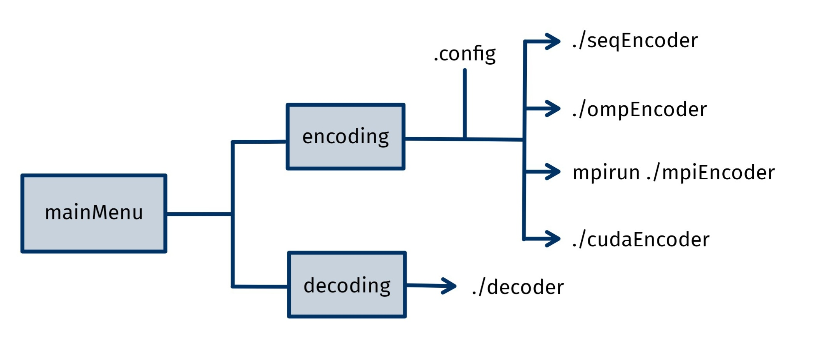

# Parallel Kmeans-based Images Compressor 

<div align="center">

</div>

This project implements a __parallel KMeans-based image colors compressor__, aimed at reducing the number of colors in a natural image while preserving its overall visual appearance. The program clusters similar colors using the __KMeans algorithm__ and applies __parallel computing techniques__ to compress the image through the __color quantization__ technique. It supports __sequential__, __OpenMP__, __MPI__, and __CUDA__ implementations to explore different levels of performance and scalability.


## Authors 
- __Leonardo Ignazio Pagliochini__  Master's Degree student in High-Performance Computing Engineering  at __Politecnico di Milano__
  
  GitHub: [leonardopagliochini](https://github.com/leonardopagliochini)  
  Email: leonardoignazio.pagliochini@mail.polimi.it

- __Francesco Rosnati__  Master's Degree student in High-Performance Computing Engineering at __Politecnico di Milano__
  
  GitHub: [RosNaviGator](https://github.com/RosNaviGator)  
  Email: francesco.rosnati@mail.polimi.it

This project was developed for the course __Advanced Methods for Scientific Computing__,  
Professor: __Luca Formaggia__  
Assistant Professor: __Matteo Caldana__  
__Politecnico di Milano__


## Doxygen Documentation
The documentation of the project can be found [here](https://leonardopagliochini.github.io/ParallelKMeansImageCompressor/).

## Prerequisites 

### OpenCV C++ Library
A comprehensive library for computer vision and image processing tasks. You can refer to the [official page](https://opencv.org/releases/) to download.
### Mpicc
A C compiler wrapper for parallel programming with the MPI library. It is advised to use `openmpi`, [official page](https://www.open-mpi.org/), as we experienced some bugs with `mpich` due to experimental version of `g++`.
### OpenMP
A C++ API for parallel programming on shared-memory systems.
### Boost
Boost is a versatile, cross-platform, and comprehensive collection of highly optimized, portable, reliable, and robust C++ libraries designed to enhance software development efficiency and extensibility.


## Getting Started

### Cloning repo
Standard coloning with `git clone`, no _submodules_ are implemented in this repo.
### Install dependencies
#### Debian based
```bash
# Run commands from PROJECT ROOT DIRECTORY
sudo chmod +x ./dependencyInstaller/dependencyInstallerDebianBased.sh
source ./dependencyInstaller/dependencyInstallerDebianBased.sh
```
#### Arch based
```bash
# Run commands from PROJECT ROOT DIRECTORY
sudo chmod +x ./dependencyInstaller/dependencyInstallerArchBased.sh
source ./dependencyInstaller/dependencyInstallerArchBased.sh
```

### Compile&Run
Program can be built with or without __CUDA__, you obviously _need_ `nvcc` to be able to compile with __CUDA__.
To compile the project, navigate to the __project root directory__ in your terminal and run the following commands.
#### DO NOT USE `mkmodules`
Program uses a version of `g++` with very recent standards, that were not supported by `mkmodules`, it is important to __unload__ modules, including `gcc-glibc` in order to succesfully compile. 
#### Without CUDA
```bash
# make without running
make
# make and run the menu (or simply run if already built)
make run
```
#### With cuda
```bash
# make without running (bulding also CUDA)
make cuda
# make and run the menu (building also CUDA)
make cudarun
```
#### Standard Run
For a standard run program will guide you to choose an _image path_, _parallel method_, _configuration settings_. See section "What to expect" for more infromation.

#### Debug/Preconfigured Run
If you want to avoid having to input all the information through the prompts requested by the program, you can preconfigure the options in the `.config` file.


## What to expect
Once the program is started, the following screen appears, through which it is possible to compress a new image or decompress an already compressed image.

<div align="center">

</div>

### Compress an image
#### Set
If you choose the "Compress an image" option you will be asked to select:
1. __Type of parallelization__ among _sequential_, _MPI_, _OpenMP_ (also CUDA if `nvcc` was used during the compiling process), the type of compression, and the path of the original image.
2. __Color level__: five levels of compression, each corresponding to a certain _percentage of retained colors_ (it's possible to visualize such percentages in the `.config` file).
3. __Image path__: The location of the original image file to be compressed.
4. __Three methods of compression__:
    - __Light Compression__: Preserves the most detail, recommended for smaller images where maintaining high quality is a priority. This level may take more time to process.
    - __Medium Compression__: Uses chroma subsampling to reduce image size and processing time. This is a balanced option for moderate size reduction while retaining good image quality.
    - __Heavy Compression__: Applies both chroma subsampling and resizing, significantly reducing the image size. Suitable for larger images where file size reduction is more important than retaining the highest possible quality.
#### Launch
After prompting all required settings the `menu` executable will exploit `boost/process` to _launch_ a specific _process_ (executable) relative to the chosen method, using the given _settings as arguments_.
### Decode image
The menu will launch the `decoder` _process_ (again with `boost/process`), there you will be asked to choose which `.kc` ('kmeans-compressed') to decode and visualize. Program creates list of `.kc` available to decode from the `output` folder. 

<div align="center">

</div>


## Project Structure

The project is organized as follows:
#### Folders
- ```benchmarkImages```: Images used for benchmarking the program. It can be used to test the program's performance.
- ```outputs```: Contains the compressed images. After installing the program, you may notice that the outputs folder is not present. However, don't worry! It will be automatically created during the first execution of the program. 
- ```include```: Header files of the project. These define the classes and functions that are used in the program.
- ```src```: Contains the source files of the project. These files contain the implementation of the classes and functions defined in the header files.
- ```build```: Object files generated during the compilation process.
- ```dependencyInstaller```: This folder contains the two scripts that can be used to install the required libraries.
- ```performanceEvaluation```: Python codes used to evaluate performance and scalability of the four type of executions.

#### Files and Executables
- ```menu```: This is the executable file generated after compiling the project. It is the main program that can be executed to compress or decompress images.
- ```Makefile```: This file contains the instructions for compiling the project. It specifies the dependencies and the commands to compile the project.
- ```.config```: This file contains the configuration of the program. It is used to store some hyperparameters that can be modified to change the behavior of the program.
- ```Doxyfile```: Is a configuration file used by Doxygen to customize the generation of documentation from annotated source code.
- ```Readme.md```: You already know that buddy ;)

## How does it work?
KMeans is a widely used clustering technique that partitions data into a given number K of clusters. In the context of image __compression__ KMeans is employed to reduce the color palette by grouping similar colors (__color quantization__), possibly minimizing the data required to represent the image.

<div align="center">

</div>

### Kmeans
The algorithm begins with an initialization phase, where $k$ initial cluster centers (means) $\mu_1^0, \mu_2^0, \ldots, \mu_k^0$ are chosen. After initialization, the algorithm enters an iterative phase, often referred to as __Lloyd’s algorithm__, which repeatedly executes two main steps until convergence is reached.
1. Assign each data point to the nearest centroid.
2. Recompute the centroids based on the data points assigned to them.

It is important to note that __K-means-based compression__ is a form of __lossy compression__. Unlike lossless compression techniques, where the original data can be perfectly reconstructed,lossy compression involves some level of data loss. In the context of K-means, each pixel's color is approximated by the nearest centroid among the $k$ chosen colors. This approximation inevitably leads to a loss of some color information, making the __compression irreversible__. The degree of perceptible data loss is often minimal when the number of clusters $k$ is adequately chosen, but it can become noticeable if $k$ is too low, resulting in a more significant approximation error

### Parallelization Techniques
The program uses several parallelization techniques to enhance performance. These techniques include:
- __OpenMP__: OpenMP is an API for parallel programming on shared-memory systems. It allows the program to parallelize the computation of the k-means algorithm by distributing the work among multiple threads.
- __MPI__: MPI is a message-passing library for parallel programming on distributed-memory systems. It allows the program to parallelize the computation of the k-means algorithm by distributing the work among multiple processes running on different nodes.
- __CUDA__: is a parallel computing platform and programming model developed by NVIDIA for general-purpose computing on GPUs (Graphics Processing Units). CUDA enables the acceleration of computationally intensive algorithms, like k-means clustering, by offloading the work to GPUs, which can process thousands of threads simultaneously. This results in a significant speedup, especially for tasks that involve large datasets and require high computational throughput.

### What Parallelization Technique Should I Choose?
That is a really good question... as everithing in computer science __it depends__.
Here you can see an overview of the execution time behaviour for increasing complexity tasks:

<div align="center">

</div>


## Report 
For more details about the program, please refer to the [report](report/report.pdf)
